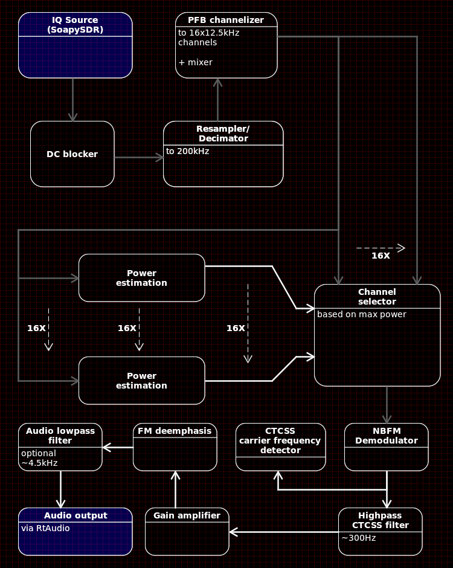
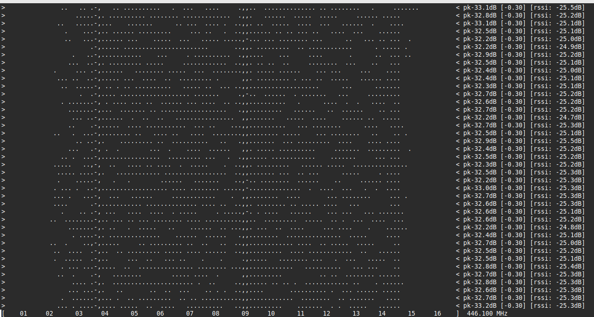

# sdr_pmr446



Simple PMR446 scanner. Doesn't jump between channels - PMR is narrow
enough (200kHz) to fit most SDRs bandwidths, so only resampling
is needed and then polyphase filterbank channelizer follows.
Each channel is NBFM demodulated, the audio filtered to remove CTCSS
and de-emphasized (+ optionally lowpass filtered). This app can
also display ASCII-rendered waterfall in terminal (`-w` argument).

Building and testing is done for RTL-SDR, but
[SoapySDR](https://github.com/pothosware/SoapySDR) is used
to interface to SDR hardware, so it all should
work with other, supported by SoapySDR, receivers.


## Building

Look at [build.yml](.github/workflows/build.yml) for details.

## Running

To run the provided `AppImage`:

```sh
./sdr_pmr446.AppImage -w 120 -g 25 -s -18
```

This will output a CLI waterfall:



## Other applications

 - `dsd_in` - simple [DSD](https://github.com/szechyjs/dsd)
    input signal processor

    Replaces the normal combination of `rtl_fm` and `sox`
    used to feed the signal into DSD while having better
    processing characteristics.
    
    To debug/listen to the demodulated output:
    ```
    ./dsd_in -f 160.0e6 -g 35 | play -r48k -traw -es -b16 -c1 -V1 -
    ```

